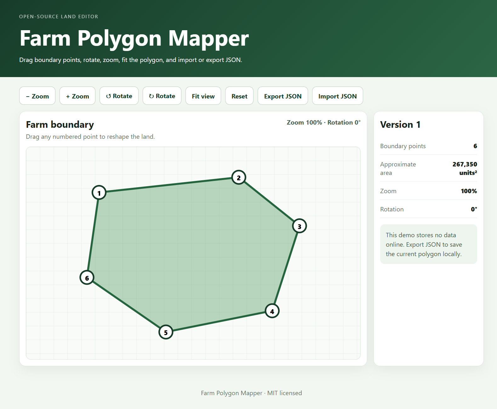

# Farm Polygon Mapper

A lightweight, local-first browser editor for creating and reshaping irregular farm or land polygons.

[](https://fatiboams.github.io/farm-polygon-mapper/)
[](RELEASE_NOTES_v1.1.0.md)
[](LICENSE)



## Version 1.1 highlights

- Add a new boundary point by selecting **Add point** and clicking an edge
- Delete the currently selected point
- Undo and redo editing actions
- Zoom at the mouse pointer using the wheel
- Pan the viewer by dragging the canvas
- Improved rotation-aware fit-to-view
- Stronger JSON validation
- Keyboard shortcuts
- Geometry unit tests

## Features

- Interactive SVG polygon editor
- Draggable numbered boundary points
- Add and delete points
- Minimum three-point safety rule
- Undo and redo history
- Mouse-wheel zoom at pointer position
- Zoom buttons
- Canvas panning
- Clockwise and counter-clockwise rotation
- Rotation-aware fit-to-view
- Center selected point
- Approximate polygon-area calculation
- Boundary-point count
- Selected-point indicator
- JSON import and export
- Self-intersection protection
- Duplicate-point validation
- Responsive browser layout
- No account, database or backend

## Live demo

**https://fatiboams.github.io/farm-polygon-mapper/**

## Usage

1. Drag a numbered point to reshape the polygon.
2. Select **Add point**, then click a highlighted edge.
3. Select a point and use **Delete point** or press `Delete`.
4. Drag the empty canvas to pan.
5. Use the mouse wheel to zoom around the pointer.
6. Export JSON to save the polygon locally.
7. Import the JSON file to restore it.

## Keyboard shortcuts

| Shortcut | Action |
|---|---|
| `Ctrl + Z` | Undo |
| `Ctrl + Y` or `Ctrl + Shift + Z` | Redo |
| `Delete` or `Backspace` | Delete selected point |
| `Escape` | Clear selection and exit add-point mode |

## JSON validation

Imported files are rejected when they contain:

- Fewer than three or more than 200 points
- Missing, non-numeric or non-finite coordinates
- Consecutive duplicate points
- Zero polygon area
- Self-intersecting edges
- Invalid zoom, rotation or pan values
- Files larger than 200 KB

The mapper uses local editor units. It is not a certified surveying or GIS measurement tool.

## Project structure

```text
farm-polygon-mapper/
├── docs/
│   └── farm-polygon-mapper-preview.png
├── src/
│   ├── app.js
│   ├── geometry.js
│   └── styles.css
├── tests/
│   └── geometry.test.mjs
├── index.html
├── package.json
├── RELEASE_NOTES_v1.1.0.md
├── LICENSE
└── README.md
```

## Run locally

Open `index.html` in a modern browser.

Because the app uses JavaScript modules, some browsers may require a local static server:

```bash
python -m http.server 8000
```

Then open `http://localhost:8000`.

## Tests

```bash
npm test
npm run check
```

The tests cover polygon area, segment projection, self-intersection detection, duplicate-point rejection, import normalization and rotation normalization.

## Privacy

The project has no backend or tracking code. Polygon data remains in the browser unless the user exports it to a local JSON file.

## Roadmap

- [ ] GeoJSON export
- [ ] SVG export
- [ ] Grid snapping
- [ ] Perimeter measurement
- [ ] Named projects
- [ ] Optional local autosave
- [ ] Accessible arrow-key point movement
- [ ] Browser interaction tests

## License

Released under the [MIT License](LICENSE).
